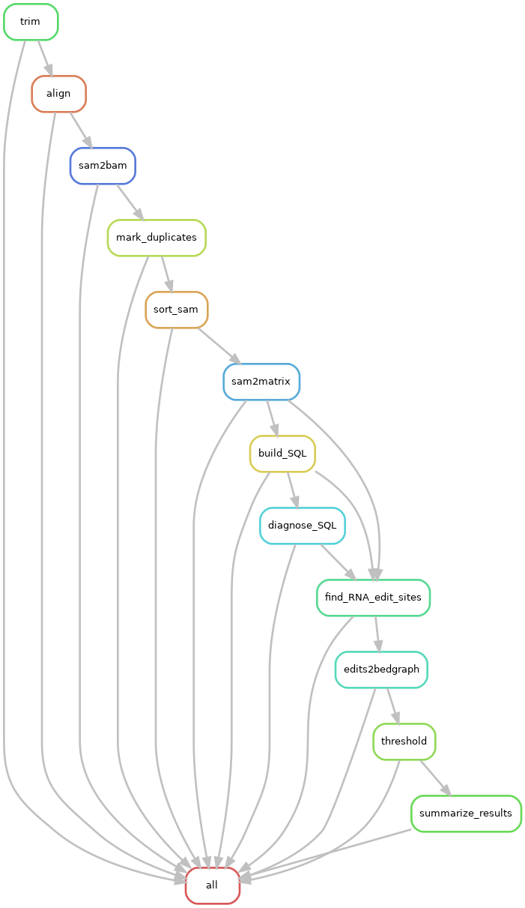

# GDSC-HyperTRIBE-pipeline
Pipeline for running HyperTRIBE to identify RNA editing sites 

# Table of Contents
- [Introduction](#introduction)
- [Pipeline](#pipeline)
- [Prerequisities](#prerequisites)
- [Implementation](#implementation)
- [Software](#software)
- [References](#references)


## Introduction
HyperTRIBE is a technique used for the identification of the targets of RNA binding proteins (RBP) in vivo. HyperTRIBE couples an RBP to the catalytic domain of the Drosophila RNA editing enzyme ADAR and expresses the fusion protein in vivo. As the RBP-ADARcd (catalytic domain) fusion protein lacks the RNA recognition features of ADAR, the specificity of the RBP should determine the editing specificity of the fusion protein. RBP targets are marked with novel RNA editing events and identified by sequencing RNA. HyperTRIBE identifies RNA editing sites (A to I change, where I is read as G) by comparing RNA sequence from transcriptome with wild type RNA (wtRNA) from the same background. 

## Pipeline
The major steps of this pipeline are as follows:

1. Trim and align sequence libraries to genome
2. Load alignment data to MySQL database
3. Find RNA A-->G edit sites against wtRNA-RNA sample



## Prerequisites
This pipeline relies on a series of conda environments and a MySQL Instance through [Dartmouth Dashboard](https://dashboard.dartmouth.edu/login?ticket=ST-53352-NHRbCfD1GUAsNsEkc4n9NgHRZYs-localhost). Should this instance fail, a new instance can be created following [these instructions](https://services.dartmouth.edu/TDClient/1806/Portal/KB/ArticleDet?ID=150826). Once an instance is generated, credentials can be obtained in the CLI section on Dartmouth Dashboard. 

**Anytime a new instance is generated, the MySQL credentials will need to be edited in the perl source code files in the `CODE` directory**

The current credentials for the MySQL instance are as follows:

|Host|Database|User|Password|Last Updated|
|----|--------|----|--------|------------|
|dmseq-f11b-db.c.dartmouth.edu|dmseq|admin|gdscPass|April 26th, 2025|


## Implementation

To interactively use the MySQL instance, run the following command:
```{shell}
mysql -h dmseq-f11b-db.c.dartmouth.edu -u admin -p --ssl-mode=REQUIRED
```

1. Clone the github repository

```shell
git clone https://github.com/Dartmouth-Data-Analytics-Core/GDSC-HyperTRIBE
cd GDSC-HyperTRIBE
```

2. Create a `samples.csv` file (comma-separated). This file is 4 columns. An example is below.

``` bash
Sample_ID,fastq_1,fastq_2,replicate
DCD,data/211338_02_S14_R1_001.fastq.gz,data/211338_02_S14_R2_001.fastq.gz,DCD
Mut,data/211338_01_S13_R1_001.fastq.gz,data/211338_01_S13_R2_001.fastq.gz,Mut
```

2. Ensure all variables in `config.yaml` are edited to point to proper paths

3. Submit Snakemake job script

```shell
sbatch job.script.sh
```

4. Upon completion of Snakemake workflow, run the annotation script on the group of interest using `CODE/hyoerTribe_Annotate.sh`
This script takes 4 arguments: path to xls results, any file name ending in .txt (for when data gets pivoted), output prefix, and path to annotation gtf. This script will create an `Annotation` directory where final results will live as a .tsv file.

```bash
bash CODE/hyperTribe_Annotate.sh \
    results/Mut.HyperTRIBE_results.xls \
    results/output.txt \
    MUT \
    Mus_musculus.GRCm39.114.gtf
```

## Software
|Tool|Version|Conda|
|----|-------|-----|
|Trimmomatic|0.39|`align`|
|bowtie2|2.5.4|`align`|
|star|2.7.11b|`align`|
|picard|3.4.0|`rnaseq1` or `align`|
|samtools|1.15.1|`samtools`|
|perl|5.32.1|`perl`|
|perl-app-cpanminus|1.7048|`perl`|
|perl-dbi|1.643|`perl`|
|perl-dbd-mysql|4.050|`perl`|
|mysql|9.3.0|`perl`|
|bedtools|TBD|TBD|

## References
For more details please see:

[HyperTRIBE ReadTheDocs](https://hypertribe.readthedocs.io/en/latest/index.html)

**Xu, W., Rahman, R., Rosbash, M.** Mechanistic Implications of Enhanced Editing by a HyperTRIBE RNA-binding protein. RNA 24, 173-182 (2018). doi:10.1261/rna.064691.117

**McMahon, A.C., Rahman, R., Jin, H., Shen, J.L., Fieldsend, A., Luo, W., Rosbash, M.** TRIBE: Hijacking an RNA-Editing Enzyme to Identify Cell-Specific Targets of RNA-Binding Proteins. Cell 165, 742-753 (2016). doi: 10.1016/j.cell.2016.03.007.

